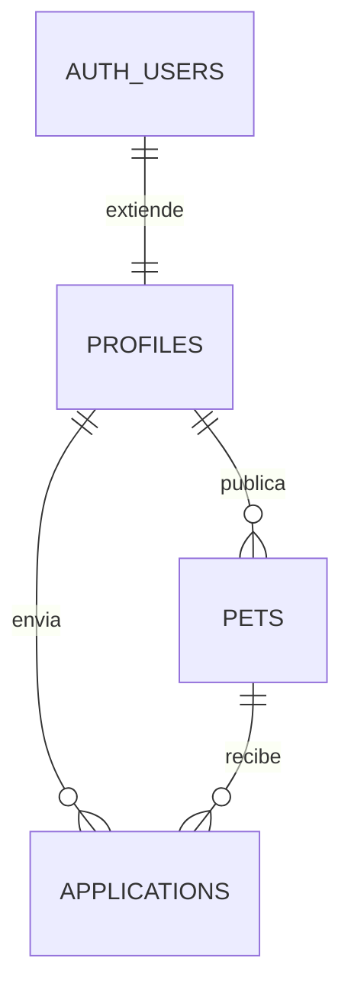

# Patitas con Hogar

Plataforma de adopción responsable que conecta refugios con familias. Los refugios publican y administran mascotas; los adoptantes exploran, filtran y envían solicitudes con seguimiento.

## Demo en vivo

Pendiente de conectar el repositorio con Vercel. Reemplaza esta línea por `https://patitas-con-hogar.vercel.app` después del despliegue.

## Capturas de pantalla

Añadir en `docs/capturas/` tres capturas después de configurar Supabase: inicio, explorador y panel de usuario.

## Stack tecnológico

- Next.js 14.2 con App Router, Server Components y Server Actions
- React 18 y TypeScript estricto
- Tailwind CSS 3.4
- Supabase PostgreSQL, Auth y Row Level Security
- Dog CEO API mediante `fetch` y `async/await`
- Vercel para producción

## Roles de usuario

- **Adoptante:** explora y filtra mascotas, consulta detalles, envía solicitudes y revisa su estado.
- **Refugio:** publica, edita y elimina sus mascotas; recibe solicitudes y las aprueba o rechaza.

El rol se almacena en `profiles.role`, se crea desde los metadatos de Supabase Auth y nunca está hardcodeado como permiso del usuario.

## Modelo de datos



- `profiles`: nombre, ciudad y rol del usuario autenticado.
- `pets`: recurso principal; pertenece a un refugio.
- `applications`: relación entre adoptante y mascota, con mensaje y estado.

Las tres tablas tienen RLS. La lectura de mascotas es pública; las mutaciones se limitan al dueño; únicamente adoptantes crean solicitudes y únicamente el refugio propietario las gestiona.

## Instalación local

1. Clona el repositorio y entra a la carpeta.
2. Ejecuta `npm install`.
3. Crea un proyecto gratuito en Supabase.
4. Copia y ejecuta `supabase/schema.sql` en el SQL Editor.
5. Copia `.env.example` como `.env.local` y completa las dos variables.
6. Ejecuta `npm run dev` y abre `http://localhost:3000`.

## Variables de entorno

```env
NEXT_PUBLIC_SUPABASE_URL=
NEXT_PUBLIC_SUPABASE_ANON_KEY=
```

Nunca se deben subir sus valores reales. `.env.local` ya está incluido en `.gitignore`.

## Credenciales de prueba

Crear después de configurar Supabase y reemplazar estos marcadores:

- Adoptante: `adoptante@ejemplo.com` / `Cambiar123!`
- Refugio: `refugio@ejemplo.com` / `Cambiar123!`

No reutilices estas contraseñas en cuentas personales.

## Funcionalidades implementadas

- [x] Rutas públicas: inicio, mascotas, detalle dinámico, login, registro y razas
- [x] Rutas privadas protegidas: panel, nueva publicación y edición
- [x] Registro, inicio y cierre de sesión con Supabase Auth
- [x] Dos roles persistidos en base de datos
- [x] Tres tablas relacionadas con llaves foráneas
- [x] RLS y políticas por propietario/rol
- [x] CRUD de mascotas con Server Actions
- [x] Gestión de solicitudes de adopción
- [x] Búsqueda y filtro con `useState` y `useMemo`
- [x] API externa con manejo de error, tiempo límite y caché
- [x] TypeScript estricto, props tipadas y sin `any`
- [ ] URL de Vercel (requiere cuenta del estudiante)
- [ ] 15+ commits históricos y repositorio GitHub
- [ ] Tres capturas reales
- [ ] Video de defensa de 15 minutos

## Rutas principales

| Ruta | Acceso | Propósito |
|---|---|---|
| `/` | Pública | Presentación y últimas mascotas |
| `/mascotas` | Pública | Listado con búsqueda y filtro |
| `/mascotas/[id]` | Pública | Detalle y postulación |
| `/razas` | Pública | Consumo de API externa |
| `/dashboard` | Privada | Panel contextual por rol |
| `/dashboard/nuevo` | Privada/refugio | Crear publicación |
| `/dashboard/editar/[id]` | Privada/dueño | Actualizar publicación |

## Autor

Completar con nombre del estudiante y perfil de GitHub.

## Video de defensa

Añadir aquí el enlace de YouTube no listado o Google Drive. Usa `GUIA_SUSTENTACION.md` como guion.
